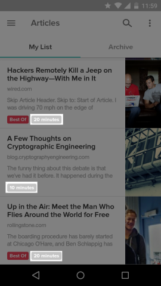
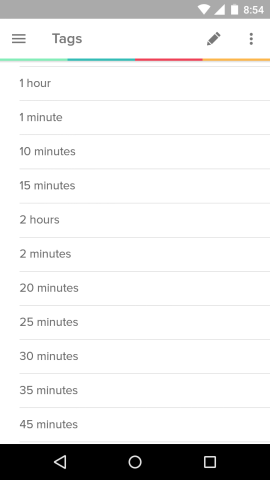

# Pocketmon

A script that tags my [Pocket](http://getpocket.com/) articles based on the time required to read them.

I wanted to make this for quite some time, but then I found [readruler.com](http://readruler.com/) which basically does the same thing, but you have to open it everytime you add new articles.

## Screenshots





## Setup

1. Install a wrapper to Pocket's API (for some reason it's not on PyPI)

```bash
$ git clone https://github.com/felipeborges/python-pocket
$ cd python-pocket
$ python setup.py build
$ python setup.py install
```

2. Getting a consumer key.

You can skip this step and just you the key of an application that I created: '44479-ea92cc886eed9b46660b84a4'. Or

Create a [new Pocket App](http://getpocket.com/developer/apps/new) & copy the consumer key of the application.

3. Getting an access token

`$ python python-pocket/get_access_token.py`

Enter your consumer key and allow access to the app in browser. This will print out your access token.

4. Update the configuration

`cp config.py.example config.py`

Store both the consumer key and access token in this new file.

5. Test whether it works

`$ python pocketmon.py`

It will tag all untagged articles.
